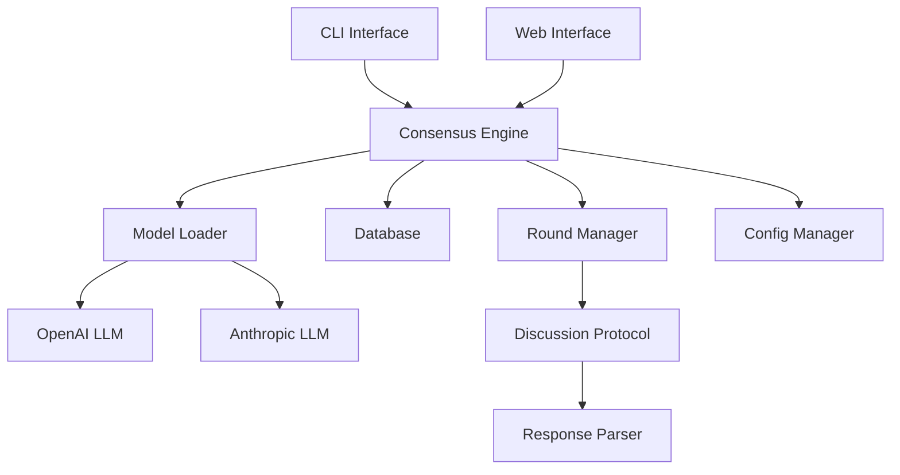
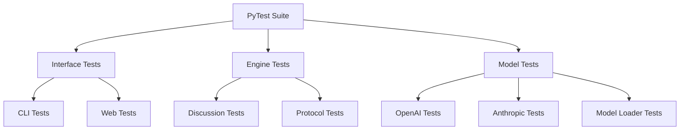

# Consensus Engine Documentation

## Overview
The Consensus Engine is a system designed to orchestrate discussions between multiple Large Language Models (LLMs) to reach consensus on various topics. It leverages different LLM providers (like OpenAI and Anthropic) and implements a structured discussion protocol.

## Architecture Diagram



## Testing Architecture



## Component Documentation
- [Engine Core](engine.md) - Core consensus engine functionality
- [Models](models.md) - LLM implementations and model loader
- [Interfaces](interfaces.md) - CLI and web interfaces
- [Database](database.md) - Data persistence layer
- [Configuration](configuration.md) - System configuration
- [Protocols](protocols.md) - Discussion protocols and round management
- [Testing](testing.md) - Testing strategy and implementation

## Quick Start
1. Install dependencies: `pip install -e ".[test]"`
2. Set up environment variables:
   ```
   OPENAI_API_KEY=your_key_here
   ANTHROPIC_API_KEY=your_key_here
   ```
3. Run CLI: `consensus-engine "Your prompt here"`
4. Run Web Interface: `consensus-engine --web`
5. Run Tests: `pytest` 