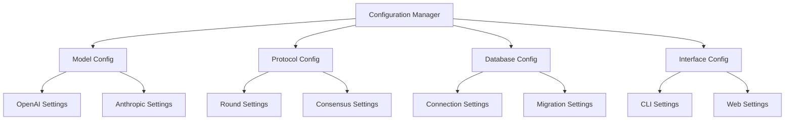

# Configuration System

## Overview
The Consensus Engine's configuration system manages settings for models, discussion protocols, database connections, and interfaces. It uses environment variables and configuration files for flexibility and security.

## Architecture



## Configuration Files

### Settings Structure
```python
# settings.py
from typing import Dict, Any
import os
from dotenv import load_dotenv

load_dotenv()  # Load environment variables

MODEL_CONFIGS: Dict[str, Dict[str, Any]] = {
    "openai": {
        "module_path": "consensus_engine.models.openai",
        "class_name": "OpenAILLM",
        "model": "gpt-4",
        "temperature": 0.7,
        "max_tokens": 2000,
        "system_prompt": "You are participating in a structured discussion..."
    },
    "anthropic": {
        "module_path": "consensus_engine.models.anthropic",
        "class_name": "AnthropicLLM",
        "model": "claude-2",
        "temperature": 0.7,
        "max_tokens": 2000,
        "system_prompt": "You are participating in a structured discussion..."
    }
}

CONSENSUS_SETTINGS: Dict[str, Any] = {
    "min_models": 2,
    "max_models": 5,
    "similarity_threshold": 0.8,
    "max_rounds": 5,
    "timeout_seconds": 300
}

ROUND_SETTINGS: Dict[str, Dict[str, Any]] = {
    "understanding": {
        "prompt_template": "First, understand the topic: {prompt}",
        "max_tokens": 1000,
        "temperature": 0.5
    },
    "constraints": {
        "prompt_template": "Identify key constraints for: {prompt}",
        "max_tokens": 1000,
        "temperature": 0.5
    },
    "position": {
        "prompt_template": "Take a position on: {prompt}",
        "max_tokens": 1500,
        "temperature": 0.7
    }
}

DATABASE_SETTINGS: Dict[str, Any] = {
    "url": os.getenv("DATABASE_URL", "sqlite:///consensus_engine.db"),
    "pool_size": 5,
    "max_overflow": 10,
    "echo": False
}

INTERFACE_SETTINGS: Dict[str, Any] = {
    "cli": {
        "default_rounds": 3,
        "default_models": ["gpt-4", "claude-2"],
        "output_format": "rich"
    },
    "web": {
        "port": 7860,
        "host": "0.0.0.0",
        "debug": False,
        "share": False
    }
}
```

## Environment Variables

### Required Variables
```bash
# .env
OPENAI_API_KEY=your_openai_key
ANTHROPIC_API_KEY=your_anthropic_key
DATABASE_URL=sqlite:///consensus_engine.db
```

### Optional Variables
```bash
# .env
LOG_LEVEL=INFO
DEBUG=False
WEB_PORT=7860
MAX_ROUNDS=5
SIMILARITY_THRESHOLD=0.8
```

## Configuration Loading

### Environment Loading
```python
def load_environment():
    """Load environment variables."""
    load_dotenv()
    validate_required_env()

def validate_required_env():
    """Validate required environment variables."""
    required = ['OPENAI_API_KEY', 'ANTHROPIC_API_KEY']
    missing = [var for var in required if not os.getenv(var)]
    if missing:
        raise ValueError(f"Missing required environment variables: {missing}")
```

### Model Configuration
```python
def get_model_config(model_name: str) -> Dict[str, Any]:
    """Get configuration for specific model."""
    if model_name not in MODEL_CONFIGS:
        raise ValueError(f"Unknown model: {model_name}")
    return MODEL_CONFIGS[model_name]

def validate_model_config(config: Dict[str, Any]) -> bool:
    """Validate model configuration."""
    required = ['module_path', 'class_name', 'model']
    return all(key in config for key in required)
```

## Usage Examples

### Loading Configuration
```python
# Initialize configuration
load_environment()
model_config = get_model_config("openai")
consensus_settings = CONSENSUS_SETTINGS.copy()

# Override with environment variables
if os.getenv("MAX_ROUNDS"):
    consensus_settings["max_rounds"] = int(os.getenv("MAX_ROUNDS"))
```

### Accessing Settings
```python
# Get database URL
db_url = DATABASE_SETTINGS["url"]

# Get model settings
openai_config = MODEL_CONFIGS["openai"]
model_name = openai_config["model"]

# Get round prompt
understanding_prompt = ROUND_SETTINGS["understanding"]["prompt_template"]
```

## Testing

### Configuration Tests
```python
def test_environment_loading():
    with patch.dict('os.environ', {
        'OPENAI_API_KEY': 'test-key',
        'ANTHROPIC_API_KEY': 'test-key'
    }):
        load_environment()
        assert os.getenv('OPENAI_API_KEY') == 'test-key'

def test_model_config_validation():
    config = {
        'module_path': 'path',
        'class_name': 'class',
        'model': 'model'
    }
    assert validate_model_config(config) is True
```

## Best Practices
1. Never hardcode sensitive values
2. Use environment variables for deployment-specific settings
3. Validate configurations at startup
4. Provide sensible defaults
5. Document all configuration options
6. Use type hints for configuration values
7. Implement configuration validation 