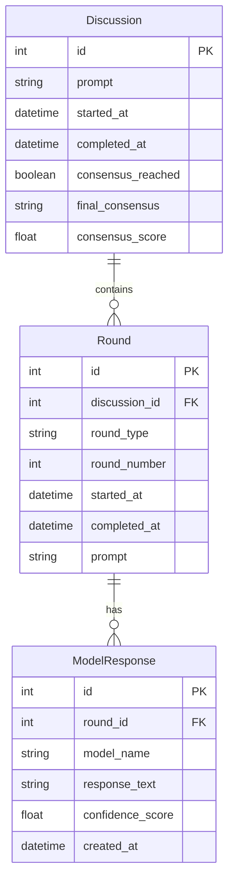

# Database Layer

## Overview
The Consensus Engine uses SQLAlchemy for data persistence, storing discussions, rounds, and model responses. The database layer is designed to track discussion history and enable analysis of consensus patterns.

## Schema Diagram



## Models

### Discussion
```python
class Discussion(Base):
    __tablename__ = 'discussions'
    
    id = Column(Integer, primary_key=True)
    prompt = Column(String, nullable=False)
    started_at = Column(DateTime, default=datetime.utcnow)
    completed_at = Column(DateTime)
    consensus_reached = Column(Boolean, default=False)
    final_consensus = Column(String)
    consensus_score = Column(Float)
    
    rounds = relationship("Round", back_populates="discussion")
```

### Round
```python
class Round(Base):
    __tablename__ = 'rounds'
    
    id = Column(Integer, primary_key=True)
    discussion_id = Column(Integer, ForeignKey('discussions.id'))
    round_type = Column(String, nullable=False)  # understanding, constraints, position
    round_number = Column(Integer, nullable=False)
    started_at = Column(DateTime, default=datetime.utcnow)
    completed_at = Column(DateTime)
    prompt = Column(String, nullable=False)
    
    discussion = relationship("Discussion", back_populates="rounds")
    responses = relationship("ModelResponse", back_populates="round")
```

### ModelResponse
```python
class ModelResponse(Base):
    __tablename__ = 'model_responses'
    
    id = Column(Integer, primary_key=True)
    round_id = Column(Integer, ForeignKey('rounds.id'))
    model_name = Column(String, nullable=False)
    response_text = Column(String, nullable=False)
    confidence_score = Column(Float)
    created_at = Column(DateTime, default=datetime.utcnow)
    
    round = relationship("Round", back_populates="responses")
```

## Database Operations

### Session Management
```python
def get_db_session():
    """Get a database session."""
    engine = create_engine(DATABASE_URL)
    Session = sessionmaker(bind=engine)
    return Session()
```

### Discussion Creation
```python
async def create_discussion(prompt: str) -> Discussion:
    discussion = Discussion(prompt=prompt)
    session.add(discussion)
    session.commit()
    return discussion
```

### Round Management
```python
async def create_round(
    discussion_id: int,
    round_type: str,
    round_number: int,
    prompt: str
) -> Round:
    round = Round(
        discussion_id=discussion_id,
        round_type=round_type,
        round_number=round_number,
        prompt=prompt
    )
    session.add(round)
    session.commit()
    return round
```

### Response Storage
```python
async def store_response(
    round_id: int,
    model_name: str,
    response_text: str,
    confidence_score: float
) -> ModelResponse:
    response = ModelResponse(
        round_id=round_id,
        model_name=model_name,
        response_text=response_text,
        confidence_score=confidence_score
    )
    session.add(response)
    session.commit()
    return response
```

## Queries

### Get Discussion History
```python
def get_discussion_history(limit: int = 10):
    return session.query(Discussion)\
        .order_by(Discussion.started_at.desc())\
        .limit(limit)\
        .all()
```

### Get Discussion Details
```python
def get_discussion_details(discussion_id: int):
    return session.query(Discussion)\
        .options(
            joinedload(Discussion.rounds)
            .joinedload(Round.responses)
        )\
        .filter(Discussion.id == discussion_id)\
        .first()
```

## Configuration
```python
DATABASE_SETTINGS = {
    "url": "sqlite:///consensus_engine.db",  # Default SQLite
    "pool_size": 5,
    "max_overflow": 10,
    "echo": False  # SQL logging
}
```

## Migration Management
Using Alembic for database migrations:
```python
# versions/001_initial.py
def upgrade():
    op.create_table(
        'discussions',
        sa.Column('id', sa.Integer(), primary_key=True),
        sa.Column('prompt', sa.String(), nullable=False),
        # ...
    )
```

## Testing
```python
def test_discussion_creation():
    with patch('sqlalchemy.create_engine'):
        discussion = create_discussion("Test prompt")
        assert discussion.prompt == "Test prompt"
        assert discussion.started_at is not None
```

## Error Handling
- Connection errors are caught and retried
- Transaction rollbacks on failure
- Integrity constraints are enforced
- Dead connections are handled

## Performance Considerations
1. Connection pooling
2. Lazy loading relationships
3. Bulk operations for efficiency
4. Index optimization
5. Query optimization 