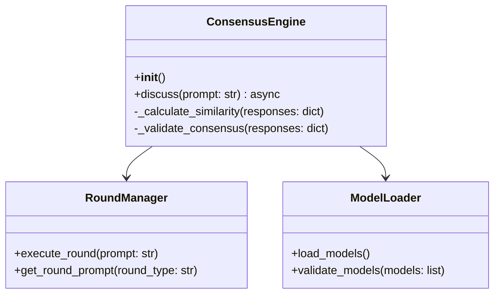

# Consensus Engine Core

## Overview
The Consensus Engine core (`ConsensusEngine` class) is responsible for orchestrating discussions between multiple LLMs to reach consensus on a given topic. It manages the discussion flow, model interactions, and consensus determination.

## Architecture



## Key Components

### Discussion Flow
1. **Initialization**
   - Load configured LLM models
   - Initialize database session
   - Set up round manager

2. **Discussion Process**
   ```python
   async def discuss(self, prompt: str, rounds: int = 3):
       # Initialize discussion
       # Execute rounds
       # Determine consensus
       # Store results
   ```

3. **Consensus Determination**
   - Calculate similarity between responses
   - Validate consensus threshold
   - Combine responses if consensus reached

### Round Management
- Each round has a specific purpose (understanding, constraints, positions)
- Round prompts are configured in settings
- Progress is tracked in database

### Database Integration
- Discussions are persisted
- Round results are stored
- Consensus status is tracked

## Configuration
```python
CONSENSUS_SETTINGS = {
    "min_models": 2,
    "max_models": 5,
    "similarity_threshold": 0.8
}
```

## Usage Example
```python
engine = ConsensusEngine()
result = await engine.discuss(
    prompt="What is the best approach to X?",
    rounds=3
)
```

## Error Handling
- Model failures are isolated
- Database errors are caught and logged
- Invalid configurations are validated early

## Testing
```python
@pytest.mark.asyncio
async def test_engine_discussion():
    with patch(...):
        engine = ConsensusEngine()
        result = await engine.discuss("test prompt")
        assert "consensus" in result
``` 