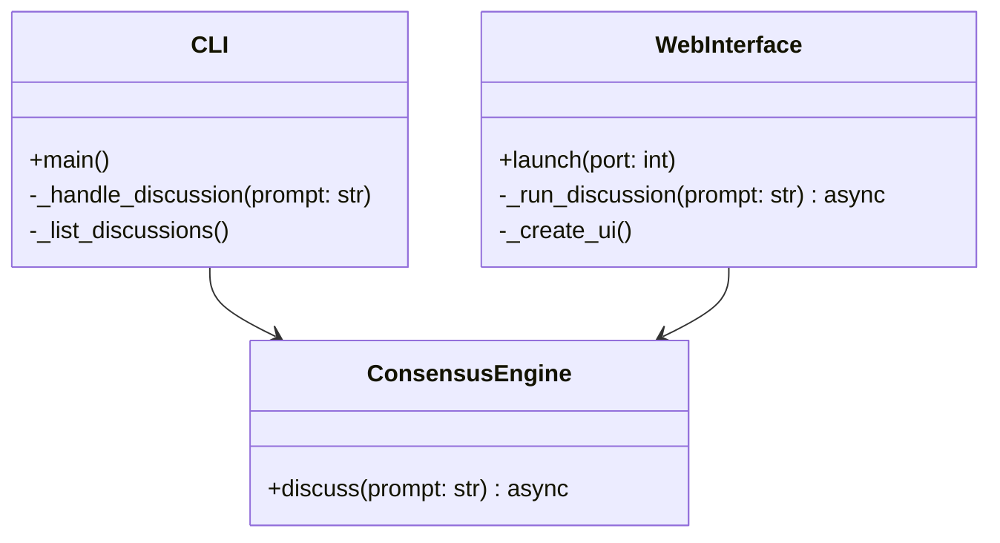
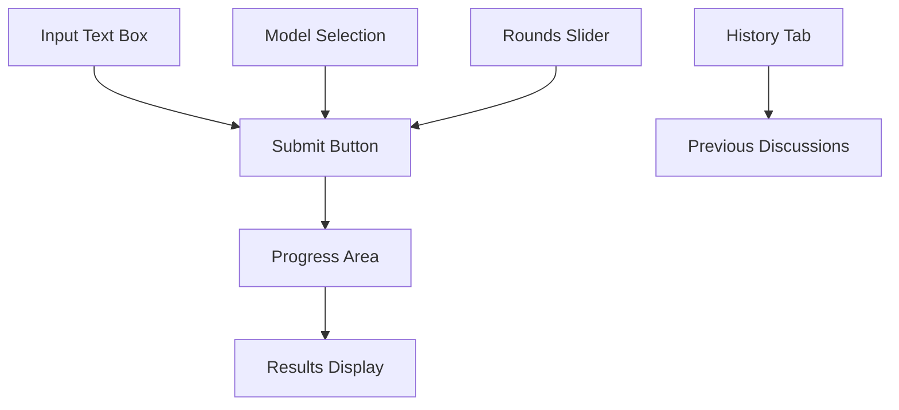

# CLI and Web Interfaces

## Overview
The Consensus Engine provides two main interfaces:
1. Command Line Interface (CLI) for direct interaction
2. Web Interface using Gradio for a graphical user experience

## Architecture



## CLI Interface

### Features
- Direct prompt input
- List previous discussions
- Configure model selection
- Set number of rounds
- View discussion progress

### Usage
```bash
# Basic usage
consensus-engine "What is the best approach to X?"

# With options
consensus-engine --rounds 5 --models "gpt-4,claude-2" "What is X?"

# List previous discussions
consensus-engine --list

# Show help
consensus-engine --help
```

### Implementation
```python
@click.command()
@click.option('--rounds', default=3, help='Number of discussion rounds')
@click.option('--models', help='Comma-separated list of models')
def main(rounds: int, models: str):
    # Initialize engine
    # Run discussion
    # Display results
```

## Web Interface

### Features
- Interactive UI with Gradio
- Real-time discussion progress
- Model selection dropdown
- Round configuration
- Discussion history view

### Implementation
```python
class GradioInterface:
    def __init__(self):
        self.engine = ConsensusEngine()
        self.blocks = gr.Blocks()
        self._create_ui()
    
    def launch(self, port: int = 7860):
        self.blocks.launch(server_port=port)
```

### UI Components


## Testing

### CLI Tests
```python
def test_cli_basic_command(cli_runner):
    result = cli_runner.invoke(main, ['--help'])
    assert result.exit_code == 0
    assert 'Consensus Engine' in result.output
```

### Web Interface Tests
```python
@pytest.mark.asyncio
async def test_web_discussion_flow():
    interface = GradioInterface()
    updates = []
    async for msg in interface._run_discussion("test"):
        updates.append(msg)
    assert any("Consensus" in msg for msg in updates)
```

## Error Handling
- Invalid CLI arguments
- Missing API keys
- Network issues
- Model failures
- Database errors

## Configuration
Both interfaces use common configuration from settings:
```python
INTERFACE_SETTINGS = {
    "default_rounds": 3,
    "default_models": ["gpt-4", "claude-2"],
    "web_port": 7860
}
``` 