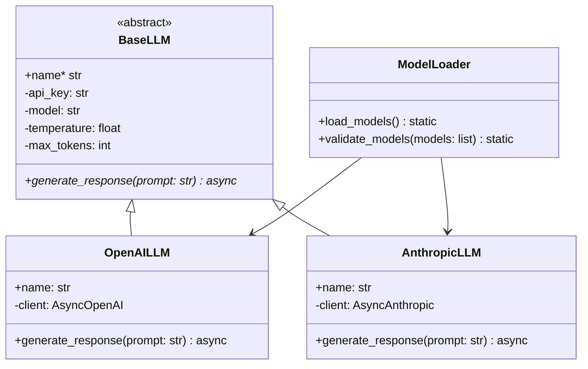

# LLM Models and Model Loader

## Overview
The models component handles interactions with different LLM providers (OpenAI, Anthropic) through a unified interface. It includes base classes, provider-specific implementations, and a dynamic model loader.

## Architecture



## Components

### Base LLM Class
```python
class BaseLLM(ABC):
    def __init__(
        self,
        api_key: str,
        model: str,
        temperature: float = 0.7,
        max_tokens: int = 2000,
        system_prompt: Optional[str] = None
    ):
        # Initialize common parameters
```

### OpenAI Implementation
```python
class OpenAILLM(BaseLLM):
    async def generate_response(self, prompt: str) -> str:
        # Use OpenAI's API to generate response
        response = await self.client.chat.completions.create(...)
        return response.choices[0].message.content
```

### Anthropic Implementation
```python
class AnthropicLLM(BaseLLM):
    async def generate_response(self, prompt: str) -> str:
        # Use Anthropic's API to generate response
        response = await self.client.messages.create(...)
        return response.content[0].text
```

### Model Loader
```python
class ModelLoader:
    @staticmethod
    def load_models() -> List[BaseLLM]:
        # Load models based on configuration
        # Initialize with appropriate API keys
        # Return list of model instances
```

## Configuration
Models are configured in settings:
```python
MODEL_CONFIGS = {
    "openai": {
        "module_path": "consensus_engine.models.openai",
        "class_name": "OpenAILLM",
        "model": "gpt-4",
        "temperature": 0.7,
        "max_tokens": 2000,
        "system_prompt": "..."
    },
    "anthropic": {
        "module_path": "consensus_engine.models.anthropic",
        "class_name": "AnthropicLLM",
        "model": "claude-2",
        "temperature": 0.7,
        "max_tokens": 2000,
        "system_prompt": "..."
    }
}
```

## Testing
Models are tested with mocked API calls:
```python
@pytest.mark.asyncio
async def test_openai_model():
    with patch('openai.AsyncClient'):
        model = OpenAILLM("test-key", "gpt-4")
        response = await model.generate_response("test")
        assert isinstance(response, str)
```

## Error Handling
- API errors are caught and logged
- Rate limiting is handled
- Invalid configurations are validated
- Network issues are handled gracefully

## Usage Example
```python
# Direct usage
model = OpenAILLM(api_key="...", model="gpt-4")
response = await model.generate_response("What is X?")

# Via loader
models = ModelLoader.load_models()
for model in models:
    response = await model.generate_response("What is X?")
``` 