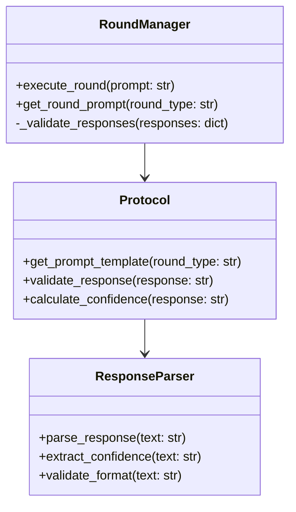
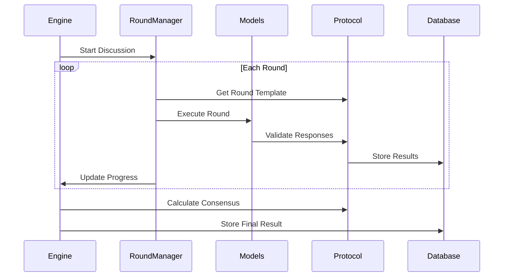

# Discussion Protocols and Round Management

## Overview
The Consensus Engine uses a structured discussion protocol to guide LLMs through a series of rounds, each with a specific purpose. The protocol is designed to achieve high-quality consensus through systematic exploration of topics.

## Architecture



## Discussion Flow



## Round Types

### 1. Understanding Round
```python
UNDERSTANDING_ROUND = {
    "type": "understanding",
    "prompt_template": """
    First, understand the topic: {prompt}
    
    Provide your understanding in the following format:
    UNDERSTANDING: [Your detailed understanding of the topic]
    CONFIDENCE: [0-1] [Explanation of your confidence level]
    """,
    "validation_rules": [
        "must_contain_understanding",
        "must_have_confidence"
    ]
}
```

### 2. Constraints Round
```python
CONSTRAINTS_ROUND = {
    "type": "constraints",
    "prompt_template": """
    Identify key constraints for: {prompt}
    
    List constraints in the following format:
    CONSTRAINTS:
    1. [First constraint]
    2. [Second constraint]
    ...
    CONFIDENCE: [0-1] [Explanation of your confidence level]
    """,
    "validation_rules": [
        "must_list_constraints",
        "must_have_confidence"
    ]
}
```

### 3. Position Round
```python
POSITION_ROUND = {
    "type": "position",
    "prompt_template": """
    Take a position on: {prompt}
    
    Structure your response as:
    POSITION: [Your clear position]
    REASONING: [Your reasoning]
    CONFIDENCE: [0-1] [Explanation of your confidence level]
    """,
    "validation_rules": [
        "must_state_position",
        "must_provide_reasoning",
        "must_have_confidence"
    ]
}
```

## Response Format

### Expected Structure
```python
class ResponseFormat:
    """Standard response format for all rounds."""
    
    def __init__(self, round_type: str):
        self.required_sections = {
            "understanding": ["UNDERSTANDING", "CONFIDENCE"],
            "constraints": ["CONSTRAINTS", "CONFIDENCE"],
            "position": ["POSITION", "REASONING", "CONFIDENCE"]
        }[round_type]
```

### Validation Rules
```python
def validate_response(text: str, round_type: str) -> bool:
    """Validate response format."""
    format = ResponseFormat(round_type)
    return all(
        section in text
        for section in format.required_sections
    )
```

## Round Management

### Round Execution
```python
async def execute_round(
    prompt: str,
    round_type: str,
    models: List[BaseLLM]
) -> Dict[str, str]:
    """Execute a single round of discussion."""
    template = get_round_template(round_type)
    formatted_prompt = template.format(prompt=prompt)
    
    responses = {}
    for model in models:
        response = await model.generate_response(formatted_prompt)
        if validate_response(response, round_type):
            responses[model.name] = response
    
    return responses
```

### Progress Tracking
```python
class ProgressTracker:
    """Track discussion progress."""
    
    def __init__(self, total_rounds: int):
        self.total_rounds = total_rounds
        self.current_round = 0
        self.round_results = []
    
    def update(self, round_result: Dict[str, str]):
        self.current_round += 1
        self.round_results.append(round_result)
```

## Consensus Calculation

### Similarity Calculation
```python
def calculate_similarity(responses: Dict[str, str]) -> float:
    """Calculate similarity between responses."""
    texts = list(responses.values())
    vectorizer = TfidfVectorizer()
    tfidf_matrix = vectorizer.fit_transform(texts)
    
    similarity_matrix = cosine_similarity(tfidf_matrix)
    return np.mean(similarity_matrix)
```

### Consensus Determination
```python
def determine_consensus(
    responses: Dict[str, str],
    threshold: float = 0.8
) -> Optional[str]:
    """Determine if consensus is reached."""
    similarity = calculate_similarity(responses)
    if similarity >= threshold:
        return combine_responses(responses)
    return None
```

## Testing

### Protocol Tests
```python
@pytest.mark.asyncio
async def test_round_execution():
    round_manager = RoundManager()
    responses = await round_manager.execute_round(
        "test prompt",
        "understanding",
        [mock_model1, mock_model2]
    )
    assert len(responses) == 2
    assert all(validate_response(r, "understanding") for r in responses.values())
```

## Error Handling
1. Invalid response formats
2. Missing confidence scores
3. Model failures during rounds
4. Timeout handling
5. Invalid round types

## Best Practices
1. Clear prompt templates
2. Strict response validation
3. Comprehensive error handling
4. Progress monitoring
5. Detailed logging
6. Performance optimization
7. Extensible round types 