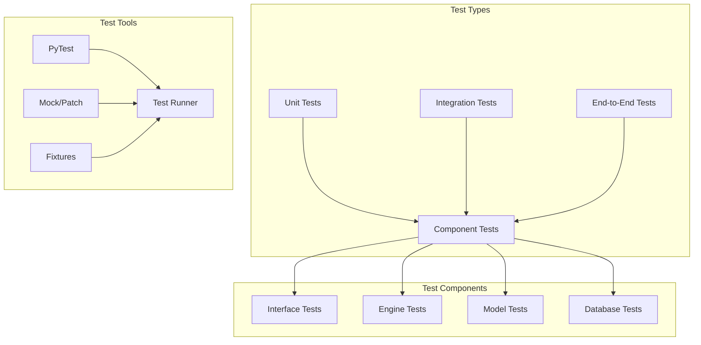

# Testing Strategy and Implementation

## Overview
The Consensus Engine uses pytest for testing, with a focus on unit tests and mocked external dependencies. The test suite covers all major components and includes async testing for the LLM interactions.

## Test Architecture



## Test Organization

### Directory Structure
```
tests/
├── __init__.py
├── test_interfaces.py
├── test_engine.py
├── test_models.py
├── test_database.py
├── test_protocols.py
└── conftest.py
```

### Common Fixtures
```python
@pytest.fixture
def cli_runner():
    return CliRunner()

@pytest.fixture
def mock_engine():
    mock = AsyncMock()
    mock.discuss = AsyncMock(return_value={
        "consensus": "Test consensus",
        "individual_responses": {
            "LLM1": "Test response 1",
            "LLM2": "Test response 2"
        }
    })
    return mock

@pytest.fixture
def mock_db_session():
    mock = MagicMock()
    mock.query = MagicMock()
    return mock
```

## Testing Strategies

### Unit Testing
```python
@pytest.mark.asyncio
async def test_engine_discussion():
    with patch(...):
        engine = ConsensusEngine()
        result = await engine.discuss("test")
        assert "consensus" in result
```

### Mock Usage
```python
# Mocking LLM API calls
@pytest.mark.asyncio
async def test_openai_model():
    with patch('openai.AsyncClient') as mock_client:
        model = OpenAILLM("test-key", "gpt-4")
        response = await model.generate_response("test")
        assert isinstance(response, str)
```

### Database Testing
```python
def test_discussion_storage():
    with patch('sqlalchemy.create_engine'):
        session = get_db_session()
        session.add(Discussion(...))
        session.commit()
```

## Test Configuration

### pytest.ini
```ini
[tool.pytest.ini_options]
asyncio_mode = "auto"
testpaths = ["tests"]
python_files = ["test_*.py"]
addopts = "-v --cov=consensus_engine --cov-report=term-missing"
```

### Coverage Settings
```toml
[tool.coverage.run]
source = ["consensus_engine"]
omit = ["tests/*", "setup.py"]

[tool.coverage.report]
exclude_lines = [
    "pragma: no cover",
    "def __repr__",
    "raise NotImplementedError"
]
```

## Running Tests

### Basic Test Run
```bash
pytest
```

### With Coverage
```bash
pytest --cov=consensus_engine --cov-report=term-missing
```

### Specific Tests
```bash
# Run specific test file
pytest tests/test_engine.py

# Run specific test function
pytest tests/test_engine.py::test_engine_discussion

# Run tests matching pattern
pytest -k "model"
```

## CI/CD Integration
```yaml
name: Tests
on: [push, pull_request]
jobs:
  test:
    runs-on: ubuntu-latest
    steps:
      - uses: actions/checkout@v2
      - name: Set up Python
        uses: actions/setup-python@v2
      - name: Install dependencies
        run: pip install -e ".[test]"
      - name: Run tests
        run: pytest --cov=consensus_engine
```

## Best Practices
1. Mock external dependencies
2. Use fixtures for common setup
3. Test edge cases and error conditions
4. Maintain test isolation
5. Keep tests focused and readable
6. Use meaningful assertions
7. Document test purposes

## Error Handling Tests
```python
@pytest.mark.asyncio
async def test_error_handling():
    with patch(...) as mock:
        mock.side_effect = Exception("Test error")
        with pytest.raises(Exception):
            await function_under_test()
``` 